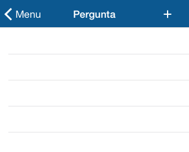

ETSlideTextView
========
If you need a simple way to capture text from your user and don't wanna use a pop up for it, **ETSlideTextView** is your solution. It's an view wrapper with a text view inside that slides from the top of your controller and manages data input from your user.


Installation
--------
Clone this repo and copy the folder **ETSlideTextView** into your Xcode project.

How-to
--------



### Initialization

Programmatically, just alloc it and set its frame:

```
- (id)initWithMasterView:(UIView *)masterView delegate:(id<ETSlideTextViewDelegate>)delegate;
- (id)initWithMasterView:(UIView *)masterView delegate:(id<ETSlideTextViewDelegate>)delegate validatingEmptyText:(BOOL)emptyText withPlaceholderAppendix:(NSString *)placeholderAppendix;
```

- `masterView` will probably be your viewcontroller's view.
- `delegate` is an optional parameter for the methods below.
- `emptyText` provides a simple validation for input's which are empty.
- `placeholderAppendix` is a localized string with is appended to the end of your confirmation button.

### Delegate

You have several delegate callbacks available to you. Just hook your delegate outlet and you are ready to go!

```
- (void)slideTextView:(ETSlideTextView *)slideTextView confirmedText:(NSString *)text;
- (void)slideTextViewWillAppear:(ETSlideTextView *)slideTextView;
- (void)slideTextViewDidAppear:(ETSlideTextView *)slideTextView;
- (void)slideTextViewWillDisappear:(ETSlideTextView *)slideTextView;
- (void)slideTextViewDidDisappear:(ETSlideTextView *)slideTextView;
```

### Localization

This component is currently translated to English, Portuguese and Spanish.

Support
--------
Just open an issue on Github and we'll get to it as soon as possible.

About
--------
**ETSlideTextView** is brought to you by Trilha.
